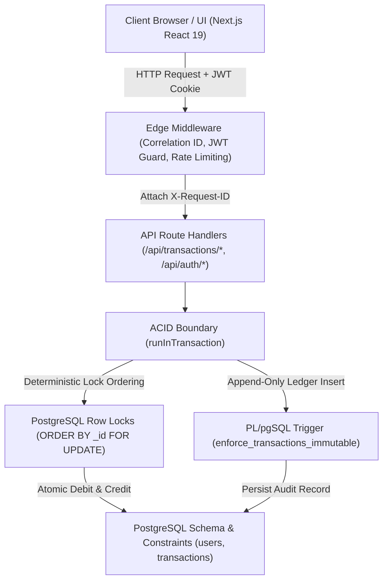

# YM-Pay — Transaction-Safe Digital Wallet & Financial Ledger System

<p align="center">
  
</p>

<p align="center">
  <strong>Production-Grade Financial Architecture • ACID Transactions • Concurrency Control • Immutable Ledger • Idempotency</strong>
</p>

<p align="center">
  <a href="#architectural-overview">Architecture</a> •
  <a href="#financial-integrity--concurrency-model">Financial Core</a> •
  <a href="#idempotency-strategy">Idempotency</a> •
  <a href="#security--sanitization">Security</a> •
  <a href="#testing--verification">Testing</a> •
  <a href="#production-readiness-boundaries">Production Boundaries</a> •
  <a href="#interview-talking-points">Interview Talking Points</a>
</p>

---

## Executive Summary

**YM-Pay** is a full-stack digital wallet and financial ledger system engineered with **TypeScript, Next.js, and PostgreSQL (Neon)**. It demonstrates the technical rigor required to build transactional payment software: strict ACID transaction boundaries, database-enforced invariants, deterministic lock ordering to prevent deadlocks, database-level ledger immutability triggers, database-backed idempotency, and sanitized data projections.

---

## Architectural Overview

YM-Pay is structured into distinct, strictly separated layers:



### Architectural Layering:
1. **Edge Middleware (`app/middleware.ts`)**: Injects distributed tracing (`X-Request-ID`), performs IP-based rate limiting via Upstash Redis, and validates HTTP-only JWT session cookies.
2. **Application / API Layer (`app/api/*`)**: Validates payloads with Zod, derives user identity strictly from verified session tokens, and executes intent-based idempotency checks.
3. **Financial Transaction Engine (`app/config/database.ts`)**: Wraps multi-statement operations in `runInTransaction`, executes deterministic row locking, conditional atomic balance updates, and append-only ledger inserts.
4. **PostgreSQL Storage Engine**: Enforces mathematical invariants via DDL `CHECK` constraints, unique partial indexes, and PL/pgSQL immutability triggers.

---

## Financial Integrity & Concurrency Model

### 1. Database-Enforced Financial Constraints
* **Non-Negative Balance**: `CHECK (balance >= 0)` guarantees that account balances can never drop below zero at the storage engine level.
* **Positive Transfer Amount**: `CHECK (amount > 0)` prevents zero or negative amounts from entering the ledger.

### 2. Deterministic Row Lock Ordering (Deadlock Prevention)
When User A transfers to User B ($A \rightarrow B$) while User B transfers to User A ($B \rightarrow A$) concurrently:
* Standard locking causes circular wait deadlocks.
* YM-Pay sorts participant UUIDs lexicographically before acquiring row locks:
  ```typescript
  const sortedIds = [String(sender._id), String(receiver._id)].sort();
  await client.query(
    `SELECT "_id" FROM users WHERE "_id" = $1 OR "_id" = $2 ORDER BY "_id" FOR UPDATE`,
    [sortedIds[0], sortedIds[1]]
  );
  ```
* Both threads lock `min(A, B)` first, then `max(A, B)`, transforming circular wait into a clean serial queue.

### 3. Concurrent Overdraft & Double-Spend Prevention
If a user with ₹100 submits two concurrent ₹80 transfers:
1. Both requests attempt `SELECT ... FOR UPDATE` on the sender row.
2. Thread 1 acquires the lock and executes atomic conditional debit:
   ```sql
   UPDATE users SET balance = balance - 80, "updatedAt" = NOW() 
   WHERE "_id" = $1 AND balance >= 80 RETURNING balance;
   ```
   `rowCount = 1`, balance becomes ₹20. Thread 1 commits.
3. Thread 2 acquires the lock and runs the same conditional debit. Because balance is now ₹20, `rowCount = 0`.
4. Thread 2 detects zero rows updated, raises an `AppError("Insufficient balance", 400)`, and rolls back.

### 4. Database-Level Ledger Immutability Trigger
To guarantee audit compliance and non-repudiation, the `transactions` table is protected by a PostgreSQL trigger:
```sql
CREATE OR REPLACE FUNCTION prevent_transaction_mutation()
RETURNS TRIGGER AS $$
BEGIN
  RAISE EXCEPTION 'Financial ledger immutability violation: UPDATE and DELETE operations are strictly prohibited on the transactions table.';
END;
$$ LANGUAGE plpgsql;

CREATE TRIGGER enforce_transactions_immutable
BEFORE UPDATE OR DELETE ON transactions
FOR EACH ROW
EXECUTE FUNCTION prevent_transaction_mutation();
```

---

## Idempotency Strategy

1. **Pre-Execution Intent Comparison**: Checks if the `idempotencyKey` exists in the database.
   * *Same Intent* (same sender, receiver, amount, type): Returns the cached original success result (`200 OK`).
   * *Mismatched Intent* (differing amount or recipient): Returns `409 Conflict`.
2. **Database Unique Constraint**:
   ```sql
   CREATE UNIQUE INDEX IF NOT EXISTS transactions_idempotency_idx 
   ON transactions ("idempotencyKey") 
   WHERE "idempotencyKey" IS NOT NULL;
   ```
   If two duplicate requests arrive simultaneously, PostgreSQL unique violation (`23505`) catches the race condition and returns HTTP 409.

---

## Security & Sanitization

* **Defense in Depth**: Authenticated user ID is derived strictly from JWT claims (`decoded.userId`), eliminating Insecure Direct Object Reference (IDOR) vulnerabilities.
* **Sensitive Field Sanitization (SEC-01)**: User projections in transaction history and server actions explicitly select only safe fields (`SELECT "_id", "firstName", "lastName", phone`). Password hashes, salts, and secrets are never returned in responses.
* **Cookie Transport**: JWT tokens are transported exclusively via `HttpOnly`, `SameSite=Lax`, and `Secure` (in production) cookies.
* **Parameterized SQL**: All database operations use `$1, $2, ...` query parameters to prevent SQL injection.
* **Observability & Request Correlation**: Middleware attaches an `X-Request-ID` UUID to every request/response for structured logging and distributed tracing.

---

## Tech Stack

| Component | Technology | Rationale |
|---|---|---|
| **Framework** | Next.js 16 (App Router) + React 19 | Serverless API routes, server actions, and modern SSR UI. |
| **Language** | TypeScript 5.9 | Strict type safety across frontend and backend boundaries. |
| **Database** | PostgreSQL (Neon) | Full ACID compliance, row locking, CHECK constraints, triggers. |
| **Styling** | TailwindCSS + Radix UI | Accessible, clean UI components. |
| **Authentication** | Stateless JWT + Bcrypt | Cryptographic session tokens with secure cookie transport. |
| **Validation** | Zod | Runtime schema validation. |
| **Testing** | Node.js Test Runner (`node:test`) | Ultra-fast native test runner with zero extra framework overhead. |

---

## Testing & Verification

YM-Pay includes a comprehensive test suite certifying unit, financial invariant, and live PostgreSQL integration behaviors.

```bash
# 1. Run Unit & Invariant Tests
npm test

# 2. Run Live PostgreSQL Integration & Concurrency Tests
npm run test:integration

# 3. TypeScript Typecheck
npm run typecheck

# 4. Lint
npm run lint

# 5. Production Build
npm run build
```


## Production Readiness Boundaries

To maintain engineering integrity, YM-Pay clearly distinguishes between implemented capabilities and real-world payment processor infrastructure:

| Feature / Domain | YM-Pay Status | Real-World Production Need |
|---|---|---|
| **Ledger & Wallet Core** | **Implemented & Tested** | Internal double-entry accounting, ACID boundaries, row locking. |
| **Idempotency & Deadlock Defense** | **Implemented & Tested** | Deterministic lock ordering, partial unique index. |
| **KYC / AML** | *Out of Scope* | Government identity verification, PEP/sanctions screening (OFAC). |
| **External Payment Rails** | *Out of Scope* | Real-time gross settlement via UPI, IMPS, FedNow, ACH, or SEPA. |
| **PCI DSS Level 1** | *Out of Scope* | Storing/processing raw 16-digit credit card primary account numbers (PAN). |
| **End-of-Day Reconciliation** | *Out of Scope* | Automated settlement reconciliation against physical bank reserve statements. |

For detailed analysis, see [docs/PRODUCTION_READINESS.md](file:///d:/Projects/YM_Pay/docs/PRODUCTION_READINESS.md).

---

## Documentation & Architecture Decision Records (ADRs)

Detailed engineering specifications and design records:
* [Architecture Blueprint](file:///d:/Projects/YM_Pay/docs/ARCHITECTURE.md)
* [Financial Integrity Specification](file:///d:/Projects/YM_Pay/docs/FINANCIAL_INTEGRITY.md)
* [Security & Threat Model](file:///d:/Projects/YM_Pay/docs/SECURITY.md)
* [Testing Architecture](file:///d:/Projects/YM_Pay/docs/TESTING.md)
* [Production Readiness Analysis](file:///d:/Projects/YM_Pay/docs/PRODUCTION_READINESS.md)

## Local Development & Setup

### Prerequisites
- Node.js (>= 20.9.0)
- PostgreSQL or Neon account

### Installation
```bash
# 1. Clone repository
git clone https://github.com/yash6366/YM-Pay.git
cd YM-Pay

# 2. Install dependencies
npm install

# 3. Configure environment variables
cp .env.example .env
# Edit .env with your NEON_DATABASE_URL and JWT_SECRET

# 4. Start development server
npm run dev
```

---

## Interview Talking Points

1. **How does YM-Pay prevent double-spending?**
   * Combines PostgreSQL row locks (`SELECT ... FOR UPDATE`) with atomic conditional balance updates (`WHERE balance >= amount`) inside an ACID transaction (`runInTransaction`).
2. **How are deadlocks prevented in concurrent bidirectional transfers?**
   * Deterministic lock ordering: sender and receiver UUIDs are sorted lexicographically before acquiring row locks, turning circular wait into a linear wait.
3. **How is the financial ledger protected against tampering?**
   * Enforced at the database level by a PL/pgSQL trigger `enforce_transactions_immutable` that aborts any `UPDATE` or `DELETE` statement.
4. **How does idempotency handle network retries?**
   * Checks the unique `idempotencyKey`. Same intent returns cached result; differing intent returns `409 Conflict`. Simultaneous race conditions are caught by PostgreSQL partial unique index.
5. **How was the sensitive data leak (SEC-01) resolved?**
   * Eliminated broad `SELECT *` object mapping by enforcing explicit projection of public fields (`id`, `firstName`, `lastName`, `phone`), ensuring password hashes and private metadata are never exposed in API responses.

---

## License
Licensed under the [MIT License](LICENSE).
