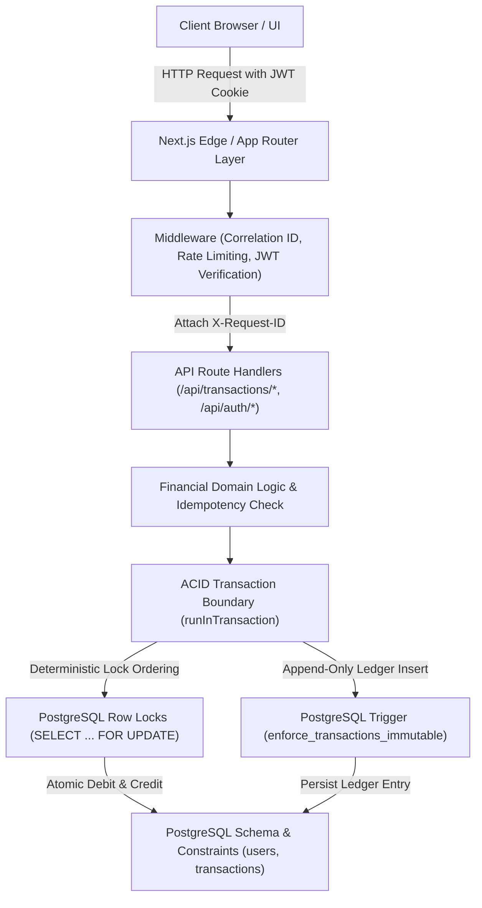
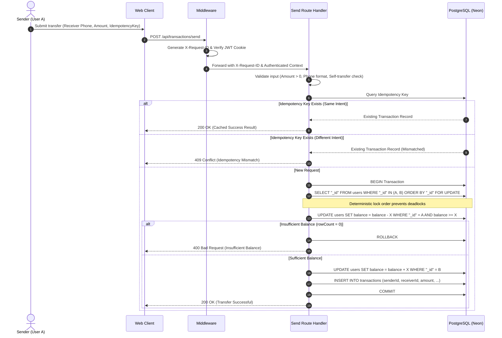

# YM-Pay System Architecture

## 1. High-Level Architectural Blueprint

YM-Pay is built on Next.js, TypeScript, and PostgreSQL. It models a transactional digital wallet system prioritizing strict financial consistency, database-enforced invariants, deterministic concurrency control, and immutable ledger auditing.

---

## 2. Request Lifecycle & Layer Breakdown

### Layer 1: Edge Middleware (`app/middleware.ts`)
1. **Request Correlation**: Generates or preserves an incoming `X-Request-ID` UUID and propagates it through request headers and response headers.
2. **Rate Limiting**: Integrated with `@upstash/ratelimit` when Redis credentials are provided; falls back gracefully if unconfigured.
3. **Authentication Guard**: Intercepts protected `/api/*` routes, reads HTTP-only JWT auth cookies (`token`), verifies signatures with `verifyToken()`, and rejects unauthorized requests with HTTP 401. Public auth routes (`/api/auth/*`) and health probes (`/api/health`) are whitelisted.
4. **CORS & Preflight Handling**: Intercepts `OPTIONS` requests, returning HTTP 204 with strict origin, method, and header whitelists.

### Layer 2: API Route Handlers (`app/api/*`)
- **Input Validation**: Validates user inputs with Zod schemas and utility guards (`isValidPhone`, `isValidAmount`, `isValidPassword`).
- **Identity Derivation**: Extracts the authenticated user ID strictly from the verified JWT payload (`decoded.userId`). Client-provided IDs in request bodies are ignored for authorization decisions.
- **Intent-Based Idempotency**: Prior to initiating transactional mutations, checks whether an idempotency key exists in the database. Returns the cached success representation if intent matches, or HTTP 409 Conflict if parameters differ.

### Layer 3: Financial Transaction Engine (`app/config/database.ts`)
- **Managed ACID Boundary**: Encapsulates operations inside `runInTransaction(async (client) => { ... })` using explicit `BEGIN`, `COMMIT`, and `ROLLBACK` handling.
- **Deterministic Row Locking**: Sorts sender and receiver UUIDs lexicographically before acquiring row locks (`SELECT "_id" FROM users WHERE ... ORDER BY "_id" FOR UPDATE`) to eliminate circular wait deadlocks on concurrent bidirectional transfers ($A \rightarrow B$ vs $B \rightarrow A$).
- **Atomic Balance Updates**: Applies conditional SQL balance deductions (`WHERE "_id" = $1 AND balance >= $2`) and recipient additions, guaranteeing atomic updates without race conditions.
- **Immutable Ledger Recording**: In the same database transaction, inserts an immutable ledger entry with sender, receiver, amount, timestamp, description, status, and idempotency key.

### Layer 4: PostgreSQL Storage & Invariant Enforcement
- **Constraint Guarantees**:
  - `check_user_balance_non_negative`: `CHECK (balance >= 0)`
  - `check_transaction_amount_positive`: `CHECK (amount > 0)`
  - `transactions_idempotency_idx`: `UNIQUE INDEX ("idempotencyKey") WHERE "idempotencyKey" IS NOT NULL`
- **Database Trigger**:
  - `enforce_transactions_immutable`: A PL/pgSQL trigger executing `BEFORE UPDATE OR DELETE ON transactions` that raises an exception, guaranteeing append-only immutability even if application logic were compromised.

---

## 3. Data Flow: Peer-to-Peer Transfer Sequence

---

## 4. Key Architectural Trade-offs

1. **Monolithic Next.js App Router vs Microservices**:
   - *Decision*: Co-locate API routes, server actions, and UI in Next.js.
   - *Rationale*: Eliminates distributed transaction complexity (two-phase commit / saga orchestration), network hops, and operational overhead while maintaining clear layered separation.
2. **PostgreSQL Row Locks vs Application-Level Mutexes**:
   - *Decision*: Rely on PostgreSQL `FOR UPDATE` row locks with deterministic sorting.
   - *Rationale*: Serverless / multi-instance web deployments render in-memory Node.js mutexes ineffective across processes. PostgreSQL provides atomic, distributed coordination natively.
3. **Database-Level Immutability Trigger vs Application Guard**:
   - *Decision*: Enforce immutable ledger with a PL/pgSQL trigger on the database table.
   - *Rationale*: Guarantees that no raw query, developer error, or compromised server action can alter or delete ledger entries.
