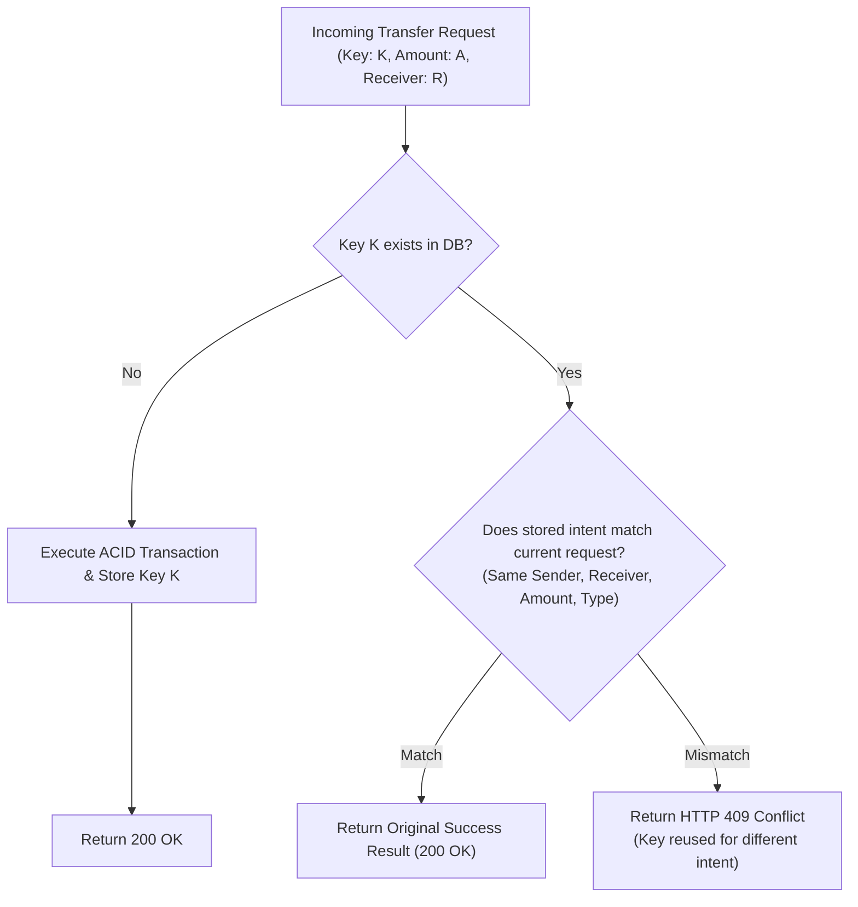

# YM-Pay Financial Integrity & Concurrency Specification

## 1. Overview & Core Invariants

YM-Pay is engineered around non-negotiable financial axioms. Every transaction is governed by strict mathematical and database-enforced guarantees.

| Invariant | Enforcement Layer | Failure Mode / Guarantee |
|---|---|---|
| **Non-Negative Balance** | PostgreSQL `CHECK (balance >= 0)` | Any operation attempting to reduce balance below 0 aborts with constraint violation. |
| **Positive Transfer Amount** | PostgreSQL `CHECK (amount > 0)` | Zero or negative amounts are rejected at both API and database levels. |
| **Ledger Immutability** | PostgreSQL Trigger (`enforce_transactions_immutable`) | `UPDATE` and `DELETE` queries on `transactions` table are blocked by database trigger. |
| **Atomic Transfer** | PostgreSQL Transaction (`BEGIN ... COMMIT / ROLLBACK`) | Sender debit, receiver credit, and ledger recording occur atomically or not at all. |
| **Deadlock Prevention** | Deterministic UUID Sorting (`ORDER BY "_id" FOR UPDATE`) | Concurrent opposing transfers ($A \rightarrow B$ & $B \rightarrow A$) acquire locks in identical order. |
| **Idempotency** | Partial Unique Index (`"idempotencyKey"`) + Intent Check | Duplicate requests return original result; altered payloads return HTTP 409 Conflict. |
| **Wealth Conservation** | Arithmetic Consistency in ACID boundary | Total system wealth remains constant during value-neutral peer transfers ($\sum \Delta \text{Balance} = 0$). |

---

## 2. Monetary Precision & Number Representation

Financial systems must prevent IEEE 754 floating-point rounding errors (e.g. `0.1 + 0.2 = 0.30000000000000004`).

1. **Database Representation**: Stored as PostgreSQL `NUMERIC(12,2)`.
2. **API & Service Standardization**:
   ```typescript
   // Standardize to 2 decimal places (minor units equivalent)
   const standardizedAmount = Math.round(numericAmount * 100) / 100
   ```
3. **Database Parser**: Configured via `pg.types.setTypeParser(1700, ...)` to ensure exact parsing without precision drift.

---

## 3. Concurrency Control & Double-Spend Prevention

### 3.1 Concurrent Overdraft Scenario
*Scenario*: User has a balance of ₹100. Two concurrent requests arrive simultaneously attempting to spend ₹80 each ($80 + 80 = 160 > 100$).

*Resolution Mechanism*:
1. Both requests begin a transaction and attempt to lock the user's row with `SELECT ... FOR UPDATE`.
2. PostgreSQL grants the lock to Request 1; Request 2 is suspended waiting for the lock.
3. Request 1 executes the conditional debit:
   ```sql
   UPDATE users 
   SET balance = balance - 80, "updatedAt" = NOW() 
   WHERE "_id" = $1 AND balance >= 80 
   RETURNING balance;
   ```
   `rowCount = 1`, new balance is ₹20. Request 1 commits and releases the lock.
4. Request 2 acquires the lock and executes the conditional debit:
   ```sql
   UPDATE users 
   SET balance = balance - 80, "updatedAt" = NOW() 
   WHERE "_id" = $1 AND balance >= 80 
   RETURNING balance;
   ```
   `rowCount = 0` because balance is now ₹20.
5. The application detects `rowCount === 0` and raises an `AppError("Insufficient balance", 400)`, triggering transaction rollback.
*Outcome*: Exactly one transaction succeeds, balance remains ₹20, double spending is prevented.

---

## 4. Deterministic Lock Ordering & Deadlock Prevention

### 4.1 The Bidirectional Deadlock Problem
If User A sends money to User B ($A \rightarrow B$) while User B concurrently sends money to User A ($B \rightarrow A$):
- Thread 1 locks User A, then requests lock on User B.
- Thread 2 locks User B, then requests lock on User A.
- Result: **Circular wait / Deadlock**. PostgreSQL would detect and abort one transaction.

### 4.2 Deterministic Ordering Solution
To eliminate circular wait, both operations sort participant IDs lexicographically before acquiring row locks:
```typescript
const sortedIds = [String(sender._id), String(receiver._id)].sort()
await client.query(
  `SELECT "_id" FROM users WHERE "_id" = $1 OR "_id" = $2 ORDER BY "_id" FOR UPDATE`,
  [sortedIds[0], sortedIds[1]]
)
```
- Both Thread 1 and Thread 2 lock `min(A, B)` first, then `max(A, B)`.
- The second thread cleanly waits for the first to complete without deadlock.

---

## 5. Database-Level Ledger Immutability Trigger

Financial compliance dictates that ledger entries must be write-once, append-only. Application-level checks alone are insufficient because direct SQL queries or developer errors could bypass them.

YM-Pay deploys a PostgreSQL trigger function:
```sql
CREATE OR REPLACE FUNCTION prevent_transaction_mutation()
RETURNS TRIGGER AS $$
BEGIN
  RAISE EXCEPTION 'Financial ledger immutability violation: UPDATE and DELETE operations are strictly prohibited on the transactions table.';
END;
$$ LANGUAGE plpgsql;

CREATE TRIGGER enforce_transactions_immutable
BEFORE UPDATE OR DELETE ON transactions
FOR EACH ROW
EXECUTE FUNCTION prevent_transaction_mutation();
```
*Effect*: Any attempt to execute `UPDATE transactions` or `DELETE FROM transactions` fails immediately with an uncatchable database-level exception.

---

## 6. Idempotency & Intent Verification

Every money-movement endpoint accepts an optional or client-generated `idempotencyKey`.



Additionally, the database enforces a partial unique index:
```sql
CREATE UNIQUE INDEX IF NOT EXISTS transactions_idempotency_idx 
ON transactions ("idempotencyKey") 
WHERE "idempotencyKey" IS NOT NULL;
```
If two identical requests race simultaneously before the preliminary intent check runs, the second transaction's `INSERT` aborts with error code `23505` (unique violation), which is caught and returned as HTTP 409 Conflict.
